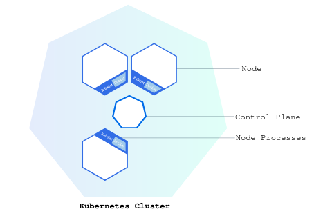
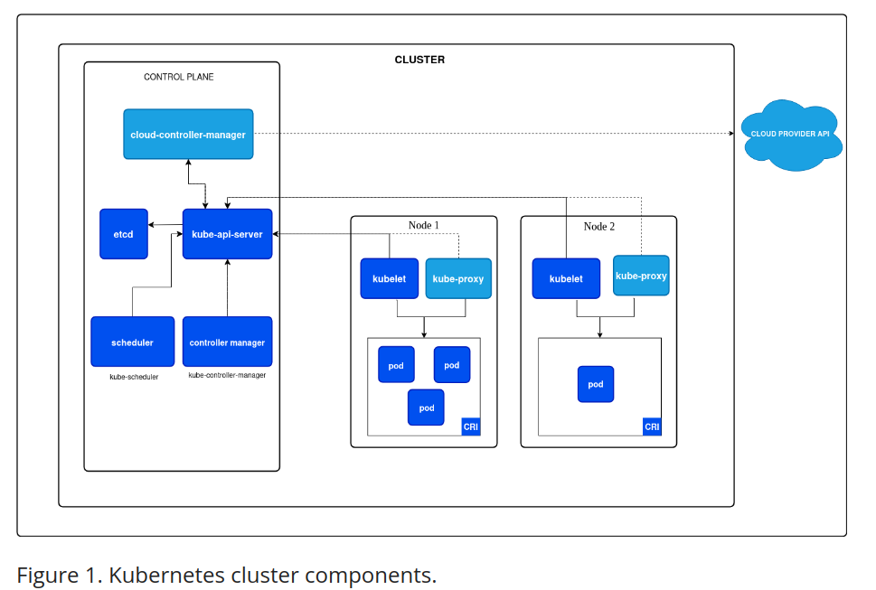

### WHAT IS KUBERNETES?

Cluster -->
Mulitple computers connected together(can be physical server or virtual machines)

Kubernetes cooridnates a highly available cluster of computers that are connected to work as a single unit

It automates the distribution and scheduling of application containers across a clusterin more effcient way.

### KUBERNETES CLUSTER

# CONTROL PLANE

It is responsible for managing the cluster such as scheduling application, maintaining application desired state, scaling application and rolling out new updates.

It manage the cluster and the nodes that are used to host the running application

# NODE

It hosts the pods that are the component of app workload.
