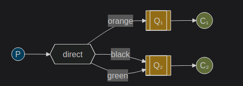
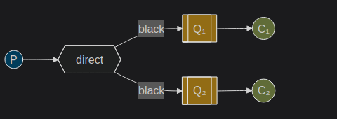
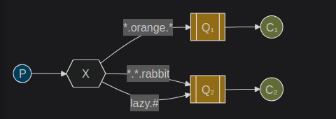

## EXCAHNGE-->

the producer never sends the event directly to queue
the procuder sends event to exchange
there are 4 exchanges --> fanout, direct , headers, topic
exchange recieves message from producers and sends them to queue/queues

fanout exchange is an exchange which broadcasts to all queue

logs is the exchange name
fanout is the exchange type
durable represents persistance nature

ch.assertExchange('logs', 'fanout', {durable: false})

DEFAULT EXCHANGE -->
we were able to send messages to queues and this was possible because
it was using default exchange (identified by "")

channel.sendToQueue('hello', Buffer.from('Hello World!'));

Here we use the default or nameless exchange: messages are routed to the queue
with the name specified as first parameter, if it exists.

channel.publish('logs','',Buffer.from('Hello'))
'' represents that we dont need to send the message to particular queue
we want only to publish it to our logs excahnge

TEMP QUEUES ->
we want to hear about all log messages not just subset

- interested only in currently flowing messages not the old ones

to solve that -->

1. we need a fresh empty queue whenever we connect to Rabbit
   to do this we can either create a random queue or let the server chose
   random queue for us
2. once we disconnect from the consumer , queue should also get deleted

we create a non-durable queue with a auto-generated name by -->

channel.assertQueue('',{exclusive:true})

## BINDINGS -->

we need to tell the exchange to send the message to our queue
relationship between exchange and queue is called a binding

channel.bind(queue_name,'logs','')
This can be simply read as: the queue is interested in messages from this exchange without any key.(IF KEY ALSO GIVEN AND THE EXCHANGE IS FANOUT IT WILL IGNORE THE KEY AS ITS BINDING TO FANOUT EXCHANGE)

## DIRECT EXCHANGE

Fanout dont give much flexibility its only capable of mindless broadcasting.
In direct exchange, message goes to the queue whose binding key excatly matches the routing key

In this message published to the exchange with a routing key orange will be routed to queue Q1. Messages with a routing key of black or green will go to Q2. All other messages will be discarded.

CASE -->

the message publish to direct exchange will get discarded if there is no matching key bindings with queue

To solve this --> we can either 2 things

1. Need to add -->

channel.publish(
'my_direct_exchange',
'order.created',
Buffer.from(JSON.stringify(payload)),
{ mandatory: true }
);

and handle basic.return callback

2. configure a fallback exchange(dead letter exchange)

x-alternate-exchange: unrouted.exchange

if no bindings matched message is routed to the alternate exchange

- Direct exchange still has limitations as it cant do routing based on multiple criteria such as emitting the log not only on the basis of severity but also the source which emitted the log like syslog unix tool (info/warn/critical...) + (auth/cron/kernel..)

## MULTIPLE BINDINGS

we could add a binding between X and Q1 with binding key black. In that case, the direct exchange will behave like fanout and will broadcast the message to all the matching queues. A message with routing key black will be delivered to both Q1 and Q2.

## TOPIC EXCHANGE

Valid routing key examples (max 255 bytes) [stock.usd.nyse, nyse.vmw, quick.orange.rabbit]

/ \* /-> represents exactly one word
/ # /-> represents >= 0 words

-- EXAMPLE --

Q1 is interested in all the orange animals
Q2 wants to hear everything about rabbits and everything about lazy animals

quick.orange.rabbit -> both
lazy.orange.elephant -> both
quick.orage.fox -> Q1
lazy.brown.fox -> Q2
lazy.pink.rabbit -> Q2 once
quick.brown.fox -> discards
quick.orange.new.rabbit -> discards
lazy.orange.new.rabbit ->Q2
