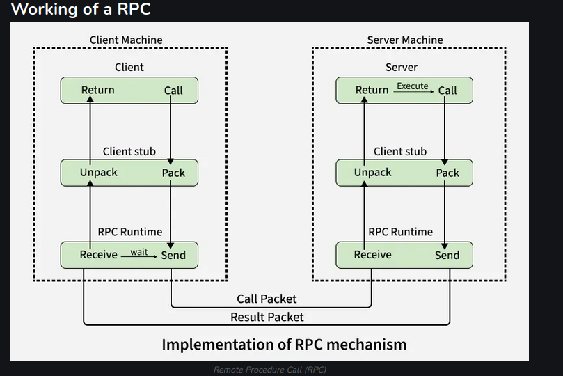

# RPC

way for a program to run a function on another computer in a network as if it were local

- # WHAT IS A STUB ??

piece of automatically generated code that acts as a local proxy for a remote function. Hides all the networking details as if it were a local function call.
It marshals and unmarshals [serialization and deserialization] the function args hands them to RPC runtime and waits for response and then unpacks the result

- # WHAT IS A RPC RUNTIME ??

the infrastructure layer that actually moves the data b/w machines.
Responsibilities -->

1. Network communication (TCP/UDP, sockets)

2. Connection management

3. Message transmission and reception

4. Timeouts, retries, error handling

5. Authentication, encryption (in many systems)

6. Binding to remote servers (naming/lookup)

HOW DOES IT WORK ??

1. Client calls stub -->
   The client calls local procedure (stub) as if it were normal.

2. Marshalling -->
   The stub packs (marshals) all input params into a message.

3. Send to server -->
   The message is sent across the network to the server

4. Server stub -->
   THe server stub unpacks [unmarshals] the message and calls the server procedure

5. Execution & Return -->
   server runs the procedure nad returns the result to the stub

6. Back To client -->
   The server stub sends the result back and the client stub unpacks it

HOLLISTIC WORKING -->

Client code calls a function

Client stub

Marshals parameters

Calls RPC runtime

RPC runtime

Sends request over network

Server RPC runtime

Receives request

Passes it to server stub

Server stub

Unmarshals parameters

Calls actual server function

Result flows back the same way

- # TYPES OF RPC

1. Callback RPC -->
   Both client and server can act as each other (useful in interactive apps. Handles deadlock and supports P2P communication)

2. Broadcast RPC -->
   client request is broadcast to all servers. Useful when multiple servers can handle the request.

3. Batch mode RPC -->
   Groups multiple client requests and sends them to server, reducing network overhead. Best for appps with infrequent calls.
